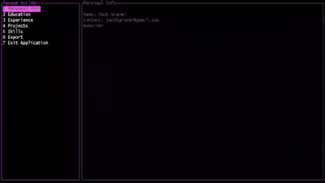

# Resume Generator



Super simple Rust-based resume generator that produces LaTeX resumes as PDFs. Provides a simple, quick way to update resume information and generate a new PDF to use.

The project uses templates and JSON data to generate the resumes. The workflow is containerized with Docker to ensure consistent builds across systems.

Serves primarily as a introductory learning project for Rust.

---

## Current Features

- Rust program to convert JSON + LaTeX templates → `.tex`
- PDF compilation using **XeLaTeX** inside a Docker container
- Volume-mapped output directory for easy access to PDFs
- Template-based generation

---

## Planned Features / Future Development

- **Terminal User Interface (TUI)** for interactive editing of data and selection of templates/data
- Support for multiple resume templates
- Optional PDF caching for faster rebuilds
- Potential export to other formats (Markdown, HTML)

---

## Usage

### With Docker

```bash
docker-compose up --build
```
